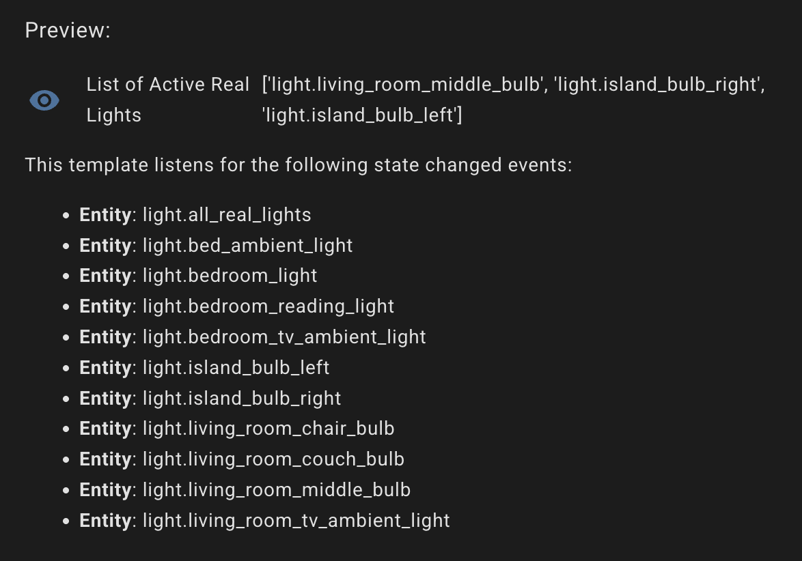
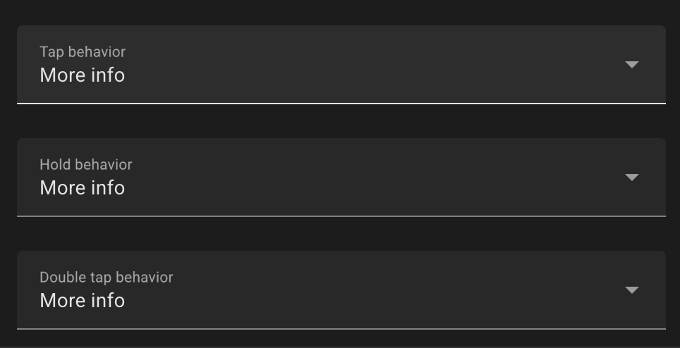
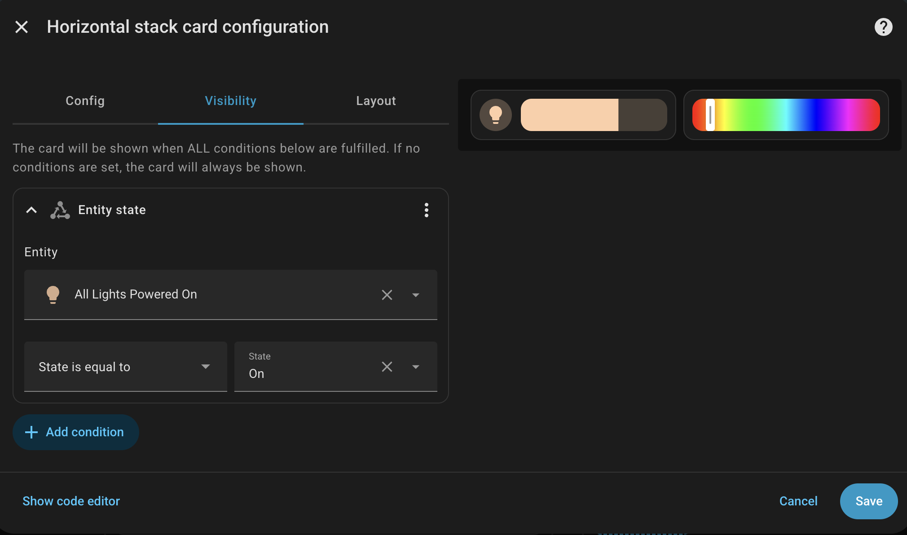

## Overview

You may have seen the title of this article and thought it was odd (or you've been banging your head against the wall like I did and found it this).
Changing the brightness and color of lights in Home Assistant seems trivial.
But if you want to change the brightness or color of *only* the lights that are currently turned on, you run into a snag.

Say you have a group of lights (via a [Helper](https://www.home-assistant.io/integrations/group/#binary-sensor-light-and-switch-groups)), and half are on, half are off.
If you go to change the brightness or color of the group, **all** the lights will turn on (and then change brightness or color).
That's probably not what you wanted.

With a little help from Gemini, I was able to cook up a solution.
This post is a How To for configuring Home Assistant for exactly this scenario.

> [!NOTE]
> This guide assumes you're using a recent version of Home Assistant and has only been tested with `2026.01`.

## Limitations

The brightness value for the virtual "All Lights Powered On" light will update each time a new light is turned on, meaning it goes out of sync with the lights that were already on.
When you change the brightness, they will all go back in sync to that value.

If there are no lights on and you try to interact with the virtual "All Lights Powered On" entity, nothing will happen (though you might see a toast error message).

## Configuration

### Create a light group

The first step is to create a light group using a Helper.

Go to *Settings* > *Devices & services* > *Helpers*, and click **Create Helper**.

Select **Group** then **Light group**.

This group should include all of your "normal" lights that you want to be able to control together when turned on.
> I say "normal lights" because many IoT devices have status lights that present in HA as regular lights, which you likely want to exclude.

I called mine "All Real Lights" (which resulted in an entity ID of `light.all_real_lights`).

### Create a sensor to hold a list of active lights

The next step is to create a template sensor, which will hold a list of entity IDs of the lights which are currently turned on.

Go to *Settings* > *Devices & services* > *Helpers*, and click **Create helper**.

Select **Template** then **Sensor**.

Give the sensor a name.
I called mine `List of Active Real Lights`.

For `State`, use the code below (this assumes you're using the same entity IDs).

```yaml
{{ expand('light.all_real_lights') | selectattr('state', 'eq', 'on') | map(attribute='entity_id') | list }}
```

This takes the previously created light group, filters for all entities with a `state` of `on`, and adds them to a list.
Down in the Preview, you should see all of the light entities from the group listed.
If you have any lights currently on, they'll be shown in the list.



### Create an automation to track state changes

Next, we need to create an automation that syncs the changes in light state from the active lights sensor (list), to a "Legacy Group".
The `groups.set` action, which is required to dynamically update the list of entities, cannot be used on modern Helper groups (such as the light group we created earlier).

Create a new Automation by going to *Settings* > *Automations & scene* and click **Create automation**.

Click **Create new automation**, then click the vertical ellipsis at the top right and then **Edit in YAML**.
Paste in the YAML below.

```yaml
alias: System - Update Dynamic Active Lights Group
description: Syncs group.hainternal_dynamic_active_lights whenever the sensor list changes.
triggers:
  - entity_id: sensor.list_of_active_real_lights
    trigger: state
  - event: start
    trigger: homeassistant
actions:
  - action: group.set
    metadata: {}
    data:
      object_id: hainternal_dynamic_active_lights
      entities: >-
        {{ states('sensor.list_of_active_real_lights') |
        regex_findall('light\.[A-Za-z0-9_-]+') }}
mode: restart
```

This automation syncs in real time and also once after a Home Assistant restart.
Since this is a legacy group, it doesn't need to be defined up front; it will be created on the fly by this action.
I called the group `hainternal_dynamic_active_lights`, as it is not used directly in the UI.

### Template for virtual light

The last step is to create a virtual light using a template configuration.
Because this setup uses a legacy group, the group cannot be remapped to be part of the light domain.
This template maps the values between the virtual light entity and the legacy group.

If you have an existing template key in `configuration.yaml`, add the snippet below (excluding the top `template:` line).

If you have templates defined in an external file (e.g., templates.yaml), remove `template:` and add to your existing file.

If you don't have any templates manually configured, add the snippet below to `configuration.yaml`.

```yaml
template:
  - light:
      - unique_id: all_lights_powered_on
        name: "All Lights Powered On"
  
        # 1. STATE
        state: "{{ is_state('group.hainternal_dynamic_active_lights', 'on') }}"
  
        # 2. BRIGHTNESS
        level: >-
          
          
            {{ lights | map(attribute='attributes.brightness') | map('int') | average | int }}
          
            0
          
  
        # 3. COLOR
        hs: >-
          
          {{ lights_with_color | first if lights_with_color else none }}
  
        # 4. ACTIONS
        # Using homeassistant.turn_on is safer for generic groups
        turn_on:
          - action: homeassistant.turn_on
            target:
              entity_id: group.hainternal_dynamic_active_lights
        
        turn_off:
          - action: homeassistant.turn_off
            target:
              entity_id: group.hainternal_dynamic_active_lights
        
        # For attributes like brightness/color, we must use light.turn_on
        set_level:
          - action: light.turn_on
            target:
              entity_id: group.hainternal_dynamic_active_lights
            data:
              brightness: "{{ brightness }}"
        
        set_hs:
          - action: light.turn_on
            target:
              entity_id: group.hainternal_dynamic_active_lights
            data:
              hs_color:
                - "{{ h }}"
                - "{{ s }}"
```

After adding this template configuration, do a full restart of Home Assistant (a "Quick Reload" won't work).

## Try it out

After the reboot, you should now see a new light called "All Lights Powered On" in your entity list and available in light-related cards.

In my dashboard, I added a new section called "Apartment-wide" and added a brightness slider and a separate color picker for this new "virtual" light in a horizontal stack (I use the [Mushroom Cards](https://github.com/piitaya/lovelace-mushroom) via HACS).
I disabled the default click behavior for these, as I don't want to accidentally click and turn off all the lights.
Instead the default behavior is to open the detail view, with the full color and brightness controls.


I also created a visibility rule to only show the horizontal stack when the virtual light is on (meaning there is at least one "real" light on).



Here's a demo of it all working in my set up.


Good luck and I hope this saves you some time!
