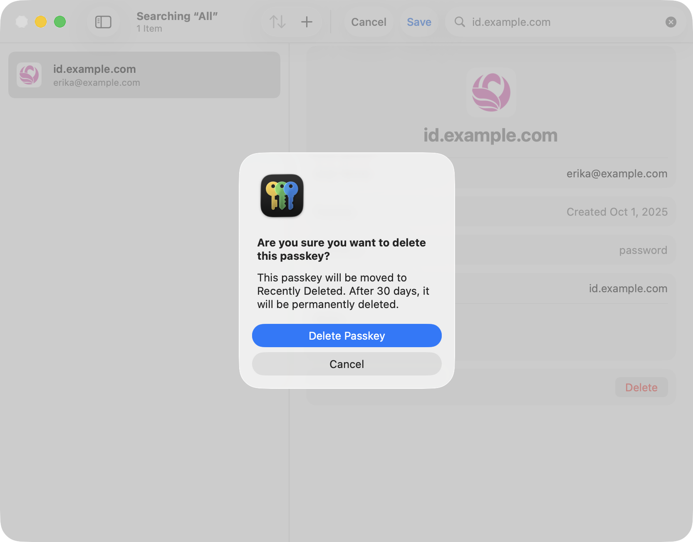
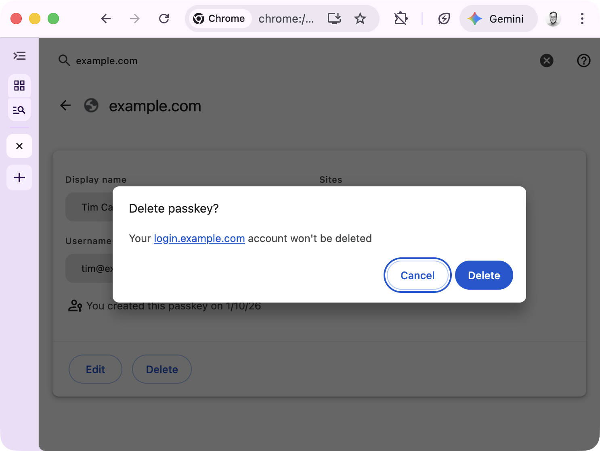
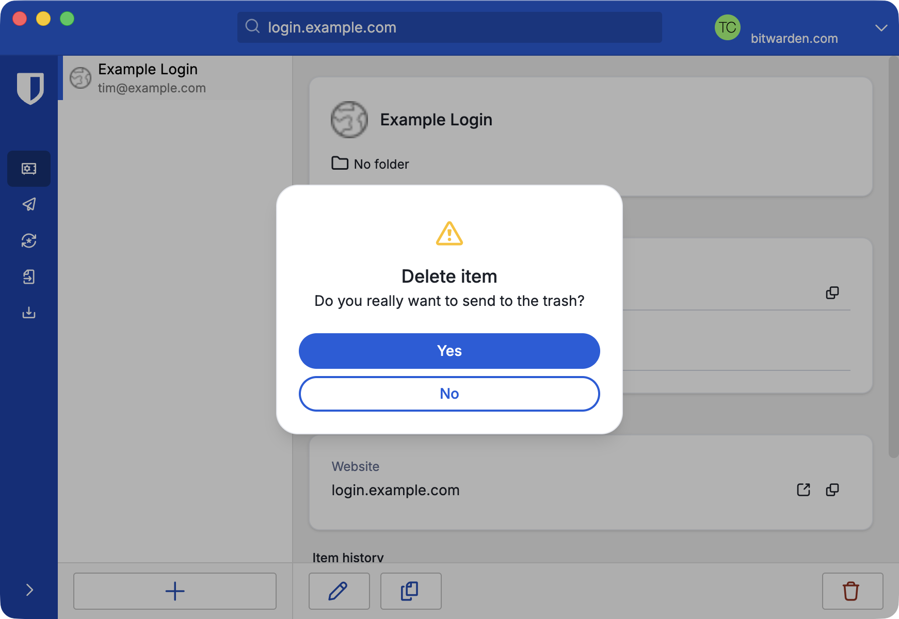

Why am I writing this today?
Because I am deeply concerned about users losing their most sacred data.

Over the past year or two, I've seen many organizations, large and small, implement passkeys (which is great, thank you!) and use the PRF (Pseudo-Random Function extension to derive keys to protect user data, typically to support end-to-end encryption.
I've also seen a number of influential folks and organizations promote the use of PRF for encrypting data.

The primary use cases I’ve seen implemented or promoted so far include:

- encrypting message backups (including images and videos)
- encrypting documents and other files
- encrypting and unlocking crypto wallets
- credential manager unlocking
- local account sign in

Why is this a problem?

When you overload a credential used for authentication by also using it for encryption, the "blast radius" for losing that credential becomes immeasurably larger.

Imagine a user named Erika. They are asked to set up encrypted backups in their favorite messaging app because they don't want to lose their messages and photos, especially those of loved ones who are no longer here.
Erika is prompted to use their passkey to enable these backups.

There is nothing in the UI that emphasizes that these backups are now tightly coupled to their passkey. Even if there were explanatory text, Erika, like most users, doesn't typically read through every dialog box, and they certainly can't be expected to remember this technical detail a year from now.

A few months pass, and Erika decides to clean up their credential manager. They don't remember why they had a specific passkey for a messaging app and deletes it.

Fast forward a year: they get a new phone and set up the messaging app. They aren't prompted to use a passkey because one no longer exists in their credential manager. Instead, they use phone number verification to recover their account. They are then guided through the "restore backup" flow and prompted for their passkey.

Since they no longer have it, they are informed that they cannot access their backed up data. Goodbye, memories.

Here's a few examples of what a user sees when they delete a passkey:

How is a user supposed to understand that they are potentially blowing away photos of deceased relatives, an encrypted property deed, or their digital currency?

**We cannot, and should not, expect users to know this.**

At this point, you may be asking why PRF is part of WebAuthn in the first place.
There are some very legitimate and more durable uses of PRF in WebAuthn, specifically supporting credential managers and operating systems.

A passkey with PRF can make unlocking your credential manager (where all of your other passkeys and credentials are stored) much faster and more secure.
Credential managers have robust mechanisms to protect your vault data with multiple methods, such as master passwords, per-device keys, recovery keys, and social recovery keys.
Losing access to a passkey used to unlock your credential manager rarely leads to complete loss of your vault data.

PRF is already implemented in WebAuthn Clients and Credential Managers, so the cat is out of the bag. My asks:

- **To the wider identity industry**: **_please stop promoting and using passkeys to encrypt user data. I'm begging you. Let them be great, phishing-resistant authentication credentials._**
- To **credential managers**: please prioritize adding warnings for users when they delete a passkey with PRF (and [displaying the RP's info page when available](https://www.w3.org/TR/passkey-endpoints/#usage))
- To **sites and services using passkeys**: if you still need to use PRF knowing these concerns, please:

    1. add an informational page to your support site explaining how you're using passkeys for more than authentication
    2. list that page URL in the [Well-Known URL for Relying Party Passkey Endpoints (`prfUsageDetails`)](https://www.w3.org/TR/passkey-endpoints/#usage)
    3. provide as much warning as possible up front to users when enabling it

Thanks for reading! 🙏🏻

(and thanks to [Matthew Miller](https://blog.millerti.me/) for reviewing and providing feedback on this post)
