## Overview

Sometimes it can be helpful to have short, stable links for web resources. The commercial "bit.ly" service made these popular many years ago.

I use these short links often in my presentations to add reference links using the " tcslides.link/{shortname} " namespace. I also use them when I know content will be moving in the future.

This guide outlines a quick method for establishing a free, easy-to-configure, and easy-to-maintain short link redirect service utilizing Cloudflare Workers and KV. The Worker is used to process the incoming request and provide a response. KV is used to store the short code to destination URL mapping as key-value pairs.

While this approach offers simplicity and cost-effectiveness, it's important to note that it lacks granular analytics on a per-link basis. Although Cloudflare provides information on the overall number of Worker executions, specific link performance metrics are not available. For my use case, this is not a concern.

## Pre-Requisites

This guide assumes:

- you already have a Cloudflare account
- you already have a domain
- that domain is already set up in Cloudflare

## Steps

### 1: Create a Workers application

Navigate to "Workers & Pages", and click **Create**.

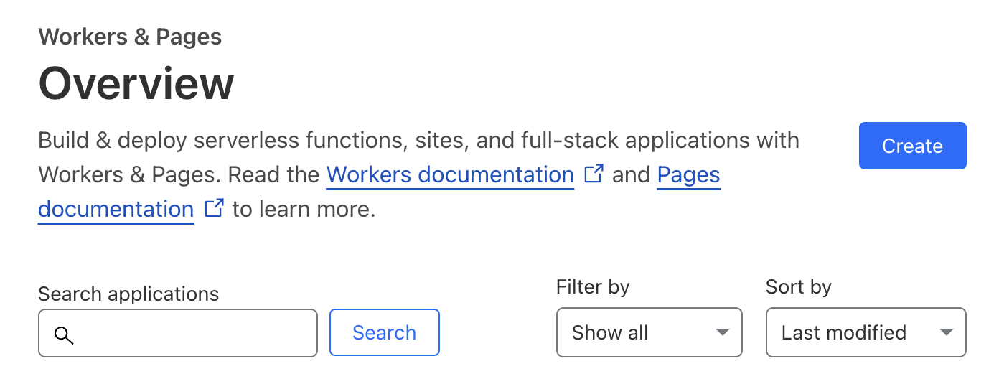

On the "Workers" tab, click **Create Worker**.

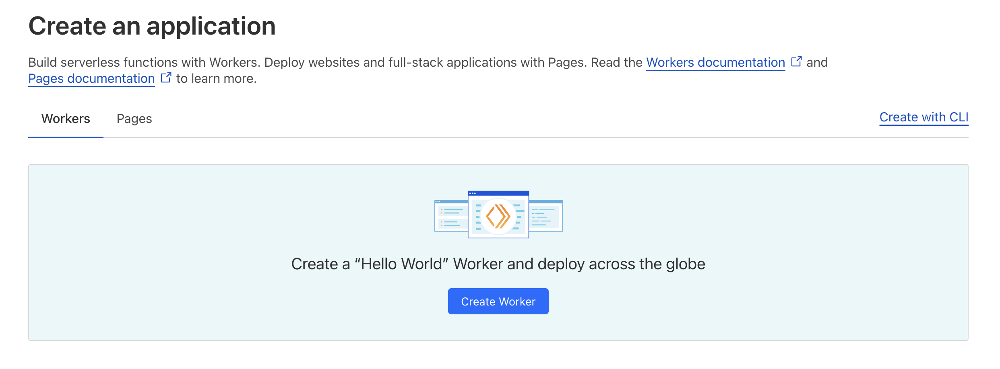

Give the worker a friendly name and click **Deploy**.

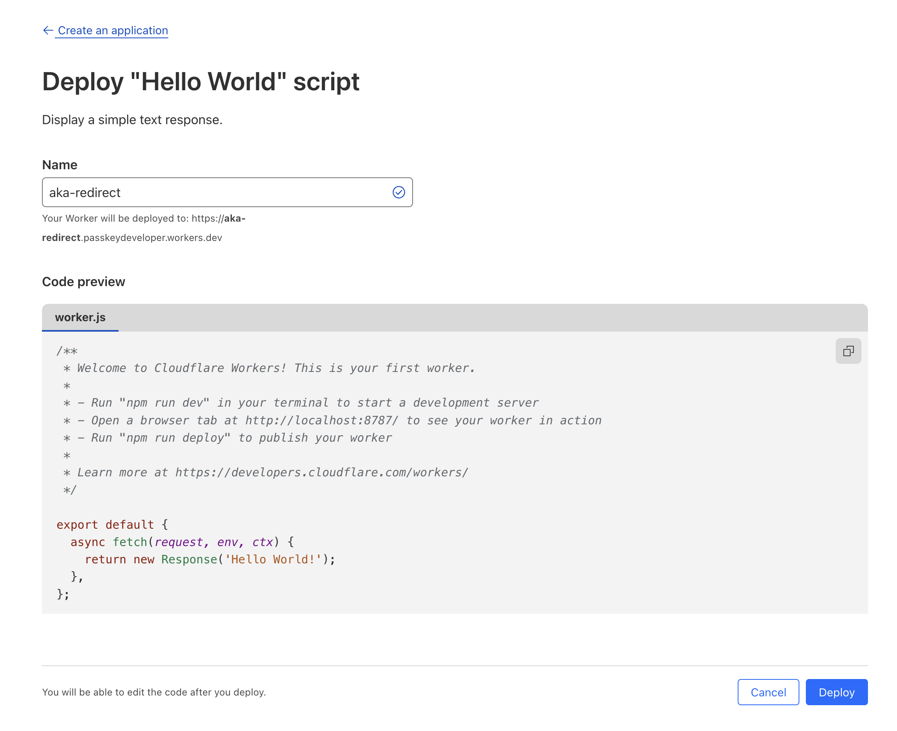

### 2: Set Up KV

Now it's time to set up KV.

In the main menu on the left, navigate to _Workers & Pages_ > _KV_, and click **Create a namespace**.

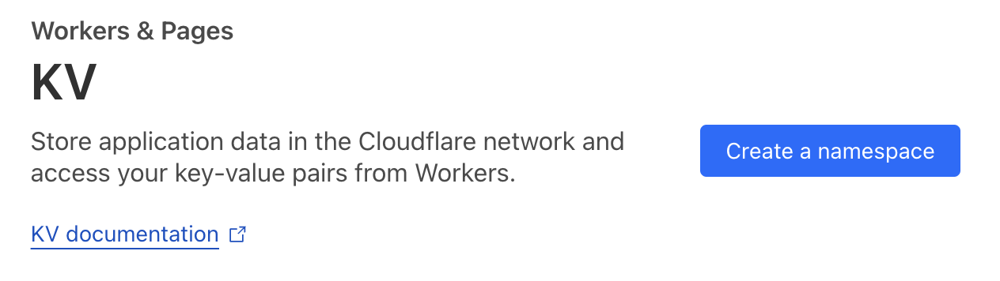

Give the namespace a name, and click **Add**.

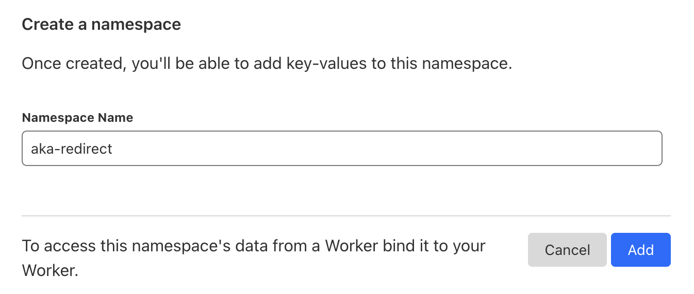

Now navigate back to the Worker (_Workers & Pages_ > _Overview_ > _{Worker Name}_ ).

On the _Settings_ tab, go to _Bindings_, and click **+ Add**.

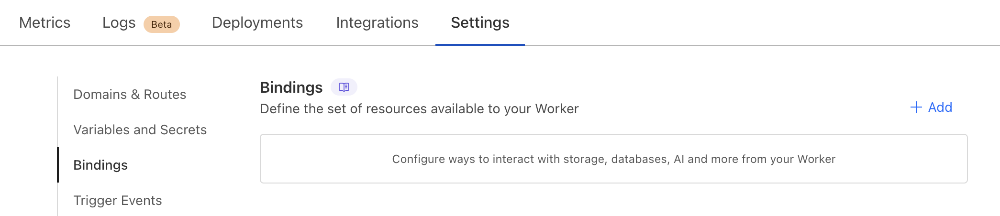

In the slideout menu, click **KV namespace**.

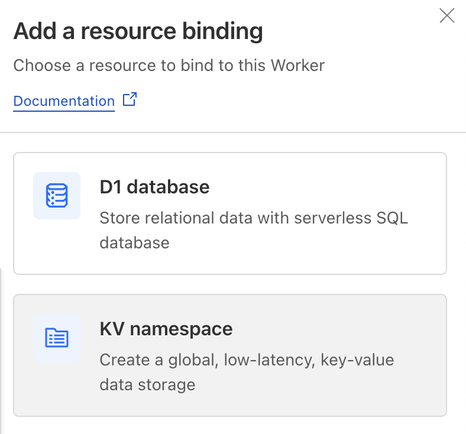

Add a variable name (ex: `redirects`) and select the KV namespace that you just created. Next to the **Deploy** button, click the downwards arrow, and click the **Save version** menu item.

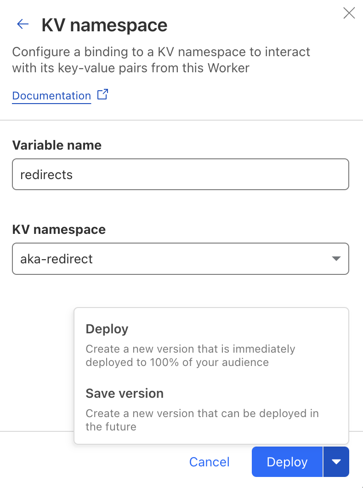

### 3: Set up the redirection code

Now click the **< / > Edit Code** button at the top right.

Copy the code below into the editor.

```js
export default {
  async fetch(request, env) {
    const url = new URL(request.url);
    const shortname = url.pathname.slice(1).toLowerCase()

    try {
      const value = await env.redirects.get(shortname)
      if (value === null) {
        return Response.redirect("https://blog.timcappalli.me", 301)
      }
      return Response.redirect(value, 302)
    } catch (err) {
      return Response.redirect("https://blog.timcappalli.me", 301)
    }
  }
};
```

Replace `redirects` on line 7 (`env.redirects.get`) with the variable name you configured in the KV binding.

Replace both instance of `https://blog.timcappalli.me` with the website that you'd like to be the default redirect destination if there is either an error or no short link match.

Click **Deploy** at the top right, then **Save and deploy** in the dialog.

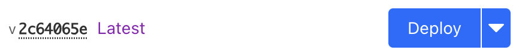

### 4: Add entries

To add entries to KV, from the main menu on the left, navigate to _Workers & Pages_ > _KV_ and click **View** for the KV name

Add the short name as "Key" and the destination URL as "Value", then click **Add Entry**.

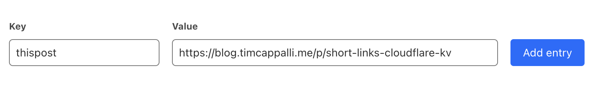

### 5: Test

Now you can test! Go back to your Workers main page, and right click on the **Visit** link at the top right and copy the link address.

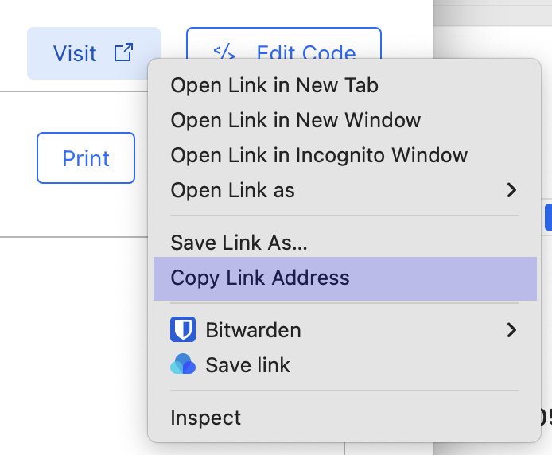

Open a new tab, paste this link, and add the short name that you just added to KV, to the end of the URL. 

Hit enter, and you should be redirected to the destination you defined!

### 6: Bind to your domain

Lastly, you'll want to set use your own domain for the Worker.

In the Worker, go to _Settings_ > _Domains & Routes_ and click **+ Add**.

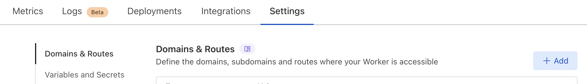

In the slideout menu, click **Custom domain**, enter your domain, and click **Add domain**.

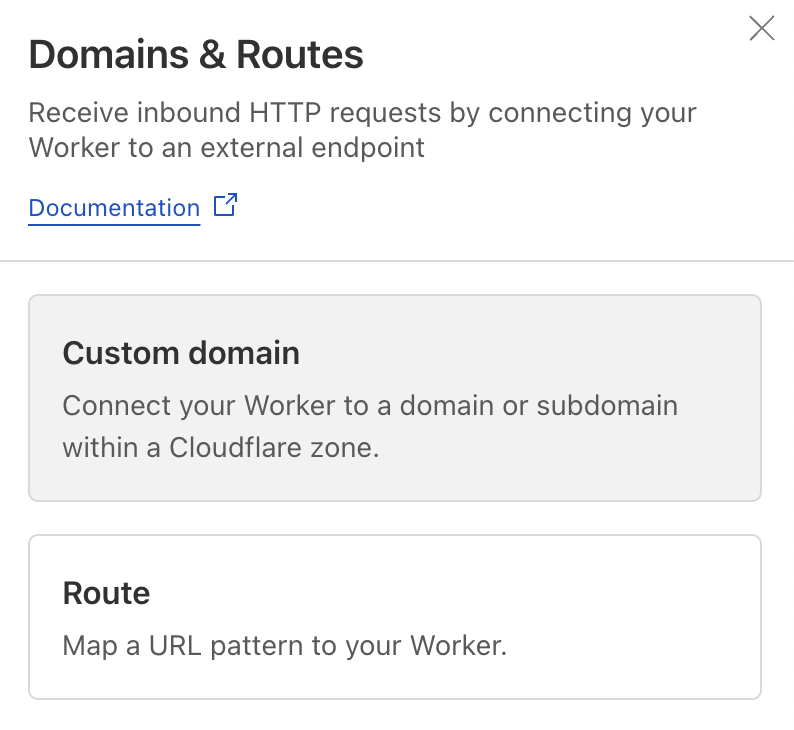

If you're not using Cloudflare DNS, add the provided DNS record to your name server.

Wait a few minutes and then it should be live!

Hope this was helpful!
