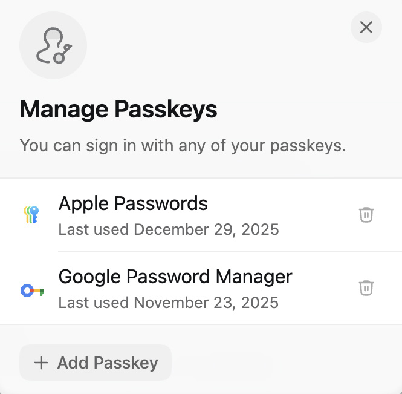

## Overview

The Web Authentication API (WebAuthn) Level 3 specification is officially a [W3C Recommendation](https://www.w3.org/policies/process/#RecsW3C).
In W3C terms, this means the specification is stable, has received wide review, and is ready for implementation by browsers and platforms.
In practice, Level 3 features are already implemented by most components of the ecosystem.

While Level 2 brought us the core standardization of phishing resistant authentication, Level 3 can best be described as the "Passkey Release."
It formalizes the technical features required to support passkeys across different ecosystems.
It also addresses the biggest pain points developers faced with Level 2, particularly around usability, cross-domain management, and the notorious difficulty of handling binary data in a JSON-native web.

This release marks the maturity of WebAuthn from a niche security standard into a mainstream phishing-resistant authentication layer for the web.


> NOTE: "Credential manager" and "authenticator" are used interchangeably throughout this post. Authenticator is the "spec-official" term.


## Features to Support Passkeys

### Additional Authenticator Data Flags

Two additional flags were allocated in [authenticator data](https://www.w3.org/TR/webauthn-3/#authenticator-data):

- [Backup Eligible (BE)](https://www.w3.org/TR/webauthn-3/#backup-eligibility)
- [Backup State (BS)](https://www.w3.org/TR/webauthn-3/#backup-state)

The `Backup Eligible` flag is useful in workforce scenarios, where Credential Managers may create both synced and device-bound passkeys.
The flags allow a Credential Manager / Authenticator to indicate to a Relying Party whether a given credential is allowed to be backed up (aka a synced passkey) or not (aka a device-bound passkey).
This flag can only be set during a creation ceremony.

> [!note]
> In the consumer passkey ecosystem, unattested passkeys, which are the default, should always be assumed to be backup eligible (aka synced passkeys).

The `Backup State` flag is useful in both consumer and workforce scenarios to indicate whether a backup eligible credential (aka a synced passkey) is _currently backed_ up.
This flag can change across each authentication ceremony.
Imagine you deleted a passkey from your Credential Manager (CM), and your CM wanted to be sure you weren't going to lose access to your account.
They could put that passkey into a pending deletion state and flip the BS bit to 0, then pop open your default browser to that site.
When you sign in using that passkey, the RP could detect that the `BS` bit is now `0` (whereas all previous authentications were `1`).
The RP could now take you through a flow to ensure you have other credentials on your account, preventing you from losing access.

> [!note]
> Backup State is currently not widely used in the ecosystem in the way described above.
> Most Credential Managers always set synced passkeys to BS=1.
> This may change in the future.

### Conditional Mediation (Autofill UI & Passkey Upgrades)

Conditional Mediation is a major new "mode" for the Credential Management API which underpins WebAuthn.
This capability powers the "Passkey Autofill UI" and "Passkey Upgrade" features.

#### Conditional Get

Conditional Get is the technical name for the **passkey autofill UI**.
With a button-based flow (e.g., "Sign in with a passkey"), the user needs to know that they already have a passkey (which they typically won't know).
Developers must also make visual changes to their login screens, which can be disruptive and require long approvals.

The passkey autofill UI solves these challenges by simply bringing passkeys into the existing autofill experience provided by the browser.
Since the UI is handled by the browser / client, nothing is disclosed to the Relying Party until the user selects a credential and interacts with their Credential Manager.
This experience is sometimes described as non-modal (whereas a traditional flow is modal).

Instead of calling WebAuthn when a button is clicked, you call WebAuthn automatically on page load, with a new `mediation: 'conditional'` parameter.
You also add a `webauthn` autocomplete token to the username (and/or password) fields on the login page.

If the user doesn't have a passkey, they just proceed normally with the existing forms-based sign-in.

")

Add the `webauthn` autocomplete token:

```html
<div>
  <label for="username">Username:</label>
  <input name="username" id="username" autocomplete="username webauthn">
</div>
```

Call WebAuthn in conditional mediation mode on page load:

```js
// 1. Create an AbortController
const abortController = new AbortController();

async function startConditionalGet() {
  // Get Client Capabilities
  const caps = await PublicKeyCredential.getClientCapabilities();

  // check for conditional get support
  if (caps.conditionalGet) {
    try {
      const response = await fetch('/auth/passkey/get-options');
      const optionsJSON = await response.json();
      const publicKeyOptions = PublicKeyCredential.parseRequestOptionsFromJSON(optionsJSON);

      // 2. Make the credentials.get() call with conditional mediation
      const credential = await navigator.credentials.get({
        mediation: 'conditional',
        publicKey: publicKeyOptions,
        signal: abortController.signal
      });

      const credentialJSON = credential.toJSON();
      await verifyLogin(credentialJSON);

    } catch (err) {
      // 3. Handle the AbortError specifically
      if (err.name === 'AbortError') {
        console.log('Conditional Get request was cancelled via AbortController');
      } else {
        console.error('WebAuthn error:', err);
      }
    }
  }
}

// 4. Hook up the abort logic to your traditional form submission
const loginForm = document.querySelector('#login-form');
loginForm.addEventListener('submit', (event) => {
  // If the user hits "Submit" to kick off a username-first flow,
  // cancel the conditional passkey flow.
  abortController.abort();

  // Proceed with standard username-first login logic...
});

// Initialize
startConditionalGet();
```

#### Conditional Create

There are some low assurance scenarios where getting the user's account into a secure state with a passkey as soon as possible is more important than a carefully curated passkey enrollment experience.

Conditional Create, commonly known as "automatic passkey upgrades", provides a way to opportunistically request that a passkey be created in the same Credential Manager from which a password was autofilled.
The key word is opportunistic.
A passkey may not be created the first time Conditional Create is used.
You can safely make the call after any password sign in, but be sure to include an excludeCredentials list containing any existing passkey credential IDs.

For Conditional Create to have any chance of succeeding, the following criteria must be met:

1. the WebAuthn Client, OS platform, and Credential Manager must all support the feature
2. the user's credential manager must have this feature enabled
3. the password for the initial account sign in must have been autofilled from a Credential Manager

The sequence:

1. user initiates a sign in by navigating to the sign in page
2. the browser autofills their username and password automatically (or they select the credential from the dropdown) and click submit
3. the username and password are sent to the backend for validation and if valid, the user is redirected to the next screen (their original destination, an additional factor prompt, an interstitial, etc)
4. the user continues on with their task, while the following happens in the background:
   1. a WebAuthn create call is initiated using the `conditional` mode
   2. the WebAuthn Client attempts to create a passkey in the credential manager which autofilled the password
   3. if successful, the user typically sees a notification from their Credential Manager notifying them of the newly created passkey
5. the next time the user signs in to this service, they're offered their passkey in the autofill UI instead of their password!

Here is some code to illustrate the sequence above:

```js
async function onPasswordLoginSuccess(serverResponse) {
  // Check if the server sent upgrade options
  if (serverResponse.passkeyUpgradeOptions) {

    // Check if the device actually supports passkeys
    // and conditional create
    const caps = await PublicKeyCredential.getClientCapabilities();
    if (caps.conditionalCreate || await PublicKeyCredential.isUserVerifyingPlatformAuthenticatorAvailable()) {

      try {
        const options = PublicKeyCredential.parseCreationOptionsFromJSON(serverResponse.passkeyUpgradeOptions);

        // Initiate the conditional creation
        const credential = await navigator.credentials.create({
          publicKey: options,
          mediation: 'conditional'
        });

        // Send the WebAuthn response to the server
        await sendWebAuthnResponseToServer(credential);

        // Continue to the original destination
        window.location.href = '/dashboard';
        return;

      } catch (e) {
        // Fail silently: do not disrupt the user's login session
        console.debug('Passkey upgrade declined or failed', e);
      }
    }
  }

  // Fallback: Proceed to the dashboard if passkeys and/or
  // conditional create aren't supported
  window.location.href = '/dashboard';
}
```

**WebAuthn RP server changes are required to support Conditional Create.**

In normal WebAuthn ceremonies, there is always a requirement for [User Presence (UP)](https://www.w3.org/TR/webauthn-3/#test-of-user-presence), meaning the user has to interact with the Credential Manager for a given ceremony.
With Conditional Create, User Presence is implied by the password autofill action, but since this does not happen during the WebAuthn ceremony, User Presence cannot be set to true in the WebAuthn create response. User Verification (UV) will also be false, as no UV occurred during the WebAuthn ceremony itself.

For this reason, your server must be configured to accept `UP=0` and `UV=0` for Conditional Create requests.
You should configure a dedicated Conditional Create challenge/options endpoint which tightly couples the initial sign in session to the create request (typically using a session cookie).

For example, you may have an endpoint at `/auth/webauthn/create` for traditional passkey creation flows.
For Conditional Create, extend this to `/auth/webauthn/create/conditional` with additional session binding, and the relaxed UP and UV checks.

### RP Signals (Signals API)

By design, Relying Parties and Credential Managers have no direct relationship.
An RP has no way to reach into a Credential Manager and say "this passkey is no longer valid" or "this user changed their name."
The RP's world ends at the WebAuthn API: it registers credentials, verifies assertions, and that's it. Credential managers, meanwhile, operate entirely on the other side of that boundary.
This separation is intentional.
It's a core part of WebAuthn's privacy model: RPs shouldn't be able to enumerate, inspect, or manipulate what's in a user's Credential Manager.
But the tradeoff is that the two sides can fall out of sync, and the friction that creates is very real for users.

Two problems surface most often. First, when a user removes a passkey from their account on the RP's side (typically in account settings), that passkey still lives in their Credential Manager.
The next time they go to sign in, it gets offered up in both the autofill UI and credential selector.
They tap it, the RP doesn't recognize it, and the sign-in fails.
Second, when a user updates their name or email address, the passkey stored in the Credential Manager still shows the original values from when it was created.
Credential selection screens show a stale name, which can be confusing and problematic in some cases.

The [RP Signals feature, more formally known as the WebAuthn Signals API](https://www.w3.org/TR/webauthn-3/#sctn-signal-methods), addresses both of these by giving RPs a sanctioned way to push state back to the WebAuthn Client.
The client is then responsible for relaying that information to relevant Credential Managers, which can then act on it, such as hiding or deleting stale credentials, or updating display metadata.

Three methods are available in the API:

- `signalUnknownCredential()` — tells the client that a specific credential ID is no longer recognized (used in a pre-authentication context)
- `signalAllAcceptedCredentials()` — provides a complete list of valid credential IDs for an authenticated user (used in a fully authenticated session)
- `signalCurrentUserDetails()` — pushes an updated name and/or displayName for a given user (used in a fully authenticated session)

> [!note]
> The Signal API is opportunistic and "fire-and-forget" by design.
> It always resolves without returning data to prevent privacy leaks.
> Whether it was acted upon only becomes apparent during a subsequent authentication ceremony.

Here are some examples of how they can be used.

A user signs in using a passkey that had been previously removed from their account.
The Relying Party shows the user a message and asks them to try again, but also calls `signalUnknownCredential()`, passing in the credential ID of the passkey that was just used along with the RP ID.
The WebAuthn Client passes this request off to Credential Managers, which can now hide (or deactivate or delete) that passkey.
The user tries to sign in again and is offered either a different passkey or an alternative authentication method.

```javascript
PublicKeyCredential.signalUnknownCredential({
    rpId: "example.dev",
    credentialId: "s9ifvBMBGTAwCbngyGF4d9BXdv54Gxub"
});
```

A user goes into their account settings to remove one of their passkeys.
When they click delete, the RP triggers its normal delete flow, but also calls `signalAllAcceptedCredentials()`, passing in all remaining valid passkey credential IDs along with the RP ID and user handle.
The WebAuthn Client passes this request off to Credential Managers, which can now hide (or deactivate or delete) any passkeys not linked to the account.

```javascript
PublicKeyCredential.signalAllAcceptedCredentials({
    rpId: "example.dev",
    userId: "019d1683-ceea-7711-adc2-0e58f11937bb",
    allAcceptedCredentialIds: [
        "ho5Z4fGRVZruKm3n5JYsH7PSII52Zr9O",
        "nZVEozNLOlizwnSYp4Az9sxT0VCvVOkd",
        "ZMEi8Ehmb7SlXo47xDwzWQZfxqJUIw0e"
    ]
});
```

A person changes their name and starts updating their online accounts to reflect their new name and email address.
When they finish editing their account details, the Relying Party calls `signalCurrentUserDetails()`, passing in the updated name and displayName values along with the RP ID and user handle.
The WebAuthn Client passes this request off to Credential Managers, which can now update any passkeys they hold for that user account.

```javascript
PublicKeyCredential.signalCurrentUserDetails({
    rpId: "example.dev",
    userId: "019d1683-ceea-7711-adc2-0e58f11937bb",
    name: "newname@example.co",
    displayName: "New Name"
});
```

## Developer Ergonomics Improvements

L3 introduces a number of "Quality of Life" improvements for developers!

### JSON (De)Serialization Methods

Previously, developers had to manually convert binary buffers (ArrayBuffers) to Base64URL strings to send them over the network, and back again on the client.
L3 introduces native helper methods directly on the `PublicKeyCredential` object:

- [`parseCreationOptionsFromJSON()`](https://www.w3.org/TR/webauthn-3/#sctn-parseCreationOptionsFromJSON)
- [`parseRequestOptionsFromJSON()`](https://www.w3.org/TR/webauthn-3/#sctn-parseRequestOptionsFromJSON)
- [`toJSON()`](https://www.w3.org/TR/webauthn-3/#dom-publickeycredential-tojson)

#### parseCreationOptionsFromJSON()

The example below highlights how `parseCreationOptionsFromJSON()` removes the need for manual Base64URL parsing libraries when handling the challenge and binary IDs:

```js
async function createPasskey() {
  // 1. Fetch registration options from your server
  // (Server sends standard JSON, keeping binary fields as Base64URL strings)
  const response = await fetch('/auth/passkey/create-request');
  const optionsJSON = await response.json();

  // Automatically converts Base64URL strings (like 'challenge' and 'user.id')
  // into the ArrayBuffers the browser needs.
  const publicKeyOptions = PublicKeyCredential.parseCreationOptionsFromJSON(optionsJSON);

  // remaining steps removed
}
```

#### parseRequestOptionsFromJSON()

The example below highlights how `parseRequestOptionsFromJSON()` removes the need for manual Base64URL parsing libraries when handling the challenge and binary IDs:

```js
async function usePasskey() {
  // 1. Fetch get options from your server
  // (Server sends standard JSON, keeping binary fields as Base64URL strings)
  const response = await fetch('/auth/passkey/get-request');
  const optionsJSON = await response.json();

  // Automatically converts Base64URL strings (like 'challenge' and 'user.id')
  // into the ArrayBuffers the browser needs.
  const publicKeyOptions = PublicKeyCredential.parseRequestOptionsFromJSON(optionsJSON);

  // remaining steps removed
}
```

#### toJSON()

To send the `create` or `get` response back to your server, the new `toJSON()` method can be used to automatically convert the PublicKeyCredential object into a JSON object where all of the binary buffers are automatically replaced with Base64URL-encoded strings.

You can use this directly or by using `JSON.stringify()`.

`toJSON()` example:

```js
  // previous steps removed

  const credentialJSON = credential.toJSON();

  await fetch('/api/passkey/create-response', {
    method: 'POST',
    headers: { 'Content-Type': 'application/json' },
    body: credentialJSON
  });
```

`JSON.stringify()` example:

```js
  // previous steps removed

  await fetch('/api/passkey/create-response', {
    method: 'POST',
    headers: { 'Content-Type': 'application/json' },
    body: JSON.stringify(credential)
  });
```

Below is a full example of a create request using both `parseCreationOptionsFromJSON()` and `JSON.stringify` (which leverages `toJSON()`):

```js
async function createPasskey() {
  // 1. Fetch create options from your server
  // (Server sends standard JSON, keeping binary fields as Base64URL strings)
  const response = await fetch('/auth/passkey/create-request');
  const optionsJSON = await response.json();

  // Automatically converts Base64URL strings (like 'challenge' and 'user.id')
  // into the ArrayBuffers the browser needs.
  const publicKeyOptions = PublicKeyCredential.parseCreationOptionsFromJSON(optionsJSON);

  // 2. Invoke the authenticator
  const credential = await navigator.credentials.create({
    publicKey: publicKeyOptions
  });

  // 3. Send the result back to your server for verification
  await fetch('/auth/passkey/create-response', {
    method: 'POST',
    headers: { 'Content-Type': 'application/json' },
    body: JSON.stringify(credentialJSON)
  });
}
```


> Huge shout out to [Matthew Miller](https://blog.millerti.me/about/) for getting this done!


### Get Client Capabilities

Two static methods previously existed for feature detection in WebAuthn: [`isUserVerifyingPlatformAuthenticatorAvailable()`](https://www.w3.org/TR/webauthn-3/#sctn-isUserVerifyingPlatformAuthenticatorAvailable) (rolls right off the tongue 🫠) and [`isConditionalMediationAvailable()`](https://www.w3.org/TR/webauthn-3/#dom-publickeycredential-isconditionalmediationavailable).
These two methods don't tell the whole story and can be misleading.
Instead of adding a bunch of new static methods to provide the missing context, we decided as a working group to stop adding new static methods and instead introduce a more dynamic method that returns all client capabilities which the client has decided to disclose.

For example, imagine having a sign in experience that is used across multiple platforms and form factors, including smart TVs.
A TV is unlikely to have a local Credential Manager / Authenticator, but may support [FIDO Cross-Device Authentication](https://passkeys.dev/docs/reference/terms/#cross-device-authentication-cda).
If you relied only on `isUserVerifyingPlatformAuthenticatorAvailable()`, you'd likely not offer passkey sign in because that method would return `false`.
Instead you could call [`getClientCapabilities()`](https://www.w3.org/TR/webauthn-3/#dom-publickeycredential-getclientcapabilities) and look for the [`passkeyPlatformAuthenticator`](https://www.w3.org/TR/webauthn-3/#dom-clientcapability-passkeyplatformauthenticator) capability, which means either there is a local Credential Manager / Authenticator available _OR_ FIDO Cross-Device Authentication is supported.
Essentially, it is possible to use a passkey on this device.

Here's some sample code for that scenario:

```js
document.addEventListener("DOMContentLoaded", async () => {
  const passkeyBtn = document.getElementById('passkey-login-btn');
  const legacyLoginForm = document.getElementById('legacy-login-form');

  // 1. Get the Client Capabilities
  const caps = await PublicKeyCredential.getClientCapabilities();

  // 2. Check for the 'passkeyPlatformAuthenticator' capability
  if (caps.passkeyPlatformAuthenticator) {
    // SCENARIO A: Device has a local Credential Manager / Authenticator
    // or supports Cross-Device Authentication,
    // Show the button, hide the traditional log in form
    passkeyBtn.style.display = 'block';
    legacyLoginForm.style.display = 'none';

  } else {
    // SCENARIO B: No local CM or cross-device support,
    // fallback to traditional log in form
    passkeyBtn.style.display = 'none';
    legacyLoginForm.style.display = 'block';
  }
});

// Button Handler
passkeyBtn.addEventListener('click', async () => {
    // Call navigator.credentials.get() ...
});
```

Each client capability is listed in the spec with a description for each: [ClientCapability](https://www.w3.org/TR/webauthn-3/#enumdef-clientcapability).

> [!note]
> When an extension is listed in the response, this means that the WebAuthn Client (typically the user agent) is aware of the extension and will pass it to the underlying platform and/or Credential Manager / Authenticator.
> It does not necessarily mean there is a Credential Manager / Authenticator available which supports the extension.

[tools.passkeys.dev/featuredetect](https://tools.passkeys.dev/featuredetect) uses Client Capabilities and serves as a demo! ([site source](https://github.com/passkeydeveloper/tools.passkeys.dev))

### AAGUID with No Attestation

Synced passkeys in the consumer ecosystem are not attested.
In previous versions of WebAuthn, when an [attestation conveyance](https://www.w3.org/TR/webauthn-3/#dom-attestationconveyancepreference-none) was set to `none`, the [AAGUID](https://www.w3.org/TR/webauthn-3/#aaguid) in the response was forced to all zeroes.
This meant that Relying Parties would have to guess which Credential Manager / Authenticator the user saved their credential in (often defaulting to the browser's name), in order to provide a user-friendly passkey management experience in account settings.

Level 3 now allows a Credential Manager / Authenticator to pass an AAGUID without attestation.
This allows a Relying Party to automatically label each passkey with the Credential Manager [name and icon](https://github.com/passkeydeveloper/passkey-authenticator-aaguids/blob/main/combined_aaguid.json).



## Capabilities for Advanced/Complex Use Cases

### Client Hints

When creating a passkey, WebAuthn Clients display a Credential Manager selection screen asking users to choose where to store their new passkey.
The selector typically defaults to local Credential Managers because they offer immediate availability and support for synced passkeys, the default credential type in unmanaged, consumer contexts.

During a sign in flow, the WebAuthn Client will do its best to help the user select a passkey which is immediately available, and fall back to an external authenticator selection screen.
This typically shows an option for FIDO Cross-Device Authentication and security keys.
In environments where only security keys are allowed, having additional options such as displaying a QR code for cross-device authentication flows can confuse users and lead to unnecessary support costs.

The WebAuthn Client Hints feature allows a Relying Party to request a more predictable experience based on their requirements.
It is important to note that this is only a hint, and is not used to enforce security policy.
Any requirements around security policy enforcement are the responsibility of the Relying Party and should be factored in to response processing in both the registration and authentication flows.

For full details on how to use Client Hints, please see [go.passkeys.dev/hints](https://go.passkeys.dev/hints).

### Related Origin Requests (ROR)

Passkeys are scoped to a specific domain at the time of creation, [the Relying Party Identifier (RP ID)](https://www.w3.org/TR/webauthn-3/#relying-party-identifier).
This allows a Relying Party to request credentials only for their site, without the user having to dig through their Credential Manager.

Imagine a global shopping site that uses country code TLDs (ccTLDs).
In the US, the site may be `shopping.com` but in Canada it may be `shopping.ca`, and `shopping.sg` in Singapore.
A passkey created for `shopping.com` will not be offered up when visiting `shopping.ca`, by design.
If someone were to be traveling, or even just VPN'd into another country, they may end up stuck at a log in page without a credential for sign in.

Another scenario is a large company with multiple public facing brands, which all use a single identity store.
Imagine an e-commerce company with a shopping site, `shopping.com` and also a video streaming platform, `shopstream.com`.
A user with a passkey for `shopping.com` cannot sign in on `shopstream.com`, but if they had a password or other credential, they could sign in without issue.

The solution for these deployments is actually not WebAuthn-related.
It is good old same-party federation using a federation protocol like OpenID Connect.
`shopping.ca` does a username lookup and then redirects the user to the appropriate ccTLD for sign in, and then redirects back with an assertion.
But in some deployments, federation is not possible.
Related Origin Requests is designed to solve these challenges when federation isn't possible for advanced and global deployments.

A full breakdown of how Related Origin Requests works, and how to deploy it in practice is available at [go.passkeys.dev/relatedorigins](https://go.passkeys.dev/relatedorigins).

### iframes

You can now make a WebAuthn create call from within a cross-origin iframe.
This is commonly used for embedded scenarios like payments on a shopping site.

A new member has been added to [client data](https://www.w3.org/TR/webauthn-3/#dictionary-client-data) called [`topOrigin`](https://www.w3.org/TR/webauthn-3/#dom-collectedclientdata-toporigin), which is populated with the origin of the top-level site (what's shown in the browser bar) where the iframe is embedded.
Relying Parties should check this value when present and ensure it matches expectations.

Just like `get` calls, create calls in an iframe require the RP to opt in using a permission policy.
See [Using Web Authentication within iframe elements](https://www.w3.org/TR/webauthn-3/#sctn-iframe-guidance) in the spec.

### Compound attestation

Compound attestation is a new attestation format which allows sending more than one attestation statement during a create call.
For example, a workforce Credential Manager creating device-bound passkeys may need to send both a key attestation (attesting to the key's provenance) and a platform attestation (attesting to the app's identity).

### Pseudo-random function (PRF) extension

This extension was added primarily to help Credential Managers with vault unlock, as well as operating systems with local account login.

It is  wrapper around [CTAP2's `hmac-secret` extension](https://fidoalliance.org/specs/fido-v2.2-ps-20250714/fido-client-to-authenticator-protocol-v2.2-ps-20250714.html#sctn-hmac-secret-extension), allowing a Relying Party to pass a salt value into the Authenticator during an assertion, which uses a credential-bound secret key to produce a deterministic output which can be used as key material.

PRF should be avoided outside these use cases.
See my [previous blog post](/p/passkeys-prf-warning) for a more detailed explanation.

## What's Next for WebAuthn?

Work has already begun on the next iteration of WebAuthn. Here's some things we're working on for Level 4:

- **Immediate UI mode**: seamless fallback to an alternative sign in experience when a passkey is not available on the local device
- **Credential Manager Trust Group (CMTG) Keys**: additional signals for Relying Parties about phishing resistant Credential Manager recovery
- **Additional error codes**: additional error codes for developers to help react and provide a better experience when something goes wrong
- **Enhanced remote desktop support**: allows use of a local credential inside a remote desktop session
- **Post-quantum enhancements**: support for post-quantum signatures, attestations, and migration paths for existing credentials
- ...and probably some more!

What else would you like to see in a future version of WebAuthn? Comment below!

## Additional Resources

- [passkeys.dev](https://passkeys.dev)
- [Passkey Developer Tools](https://tools.passkeys.dev)
- [Passkey UX and Deployment Guidance](https://passkeycentral.org)

<rbr>
<hr>

Written by a human. Grammar, spelling, and general sanity checks by Gemini & Claude.

